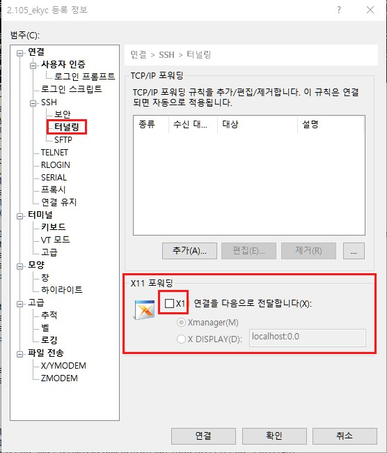

# open shared object file Error
- 아래 내용 참고, xshell 오류로 확인하였음
-  설정 변경 후 정상동작 확인 완료      
    \>> https://blog.csdn.net/weixin_42559574/article/details/120285714


```
31-Aug-2023 04:58:26.121 SEVERE [localhost-startStop-1] org.apache.catalina.core.ContainerBase.addChildInternal ContainerBase.addChild: start:
org.apache.catalina.LifecycleException: Failed to start component [StandardEngine[Catalina].StandardHost[localhost].StandardContext[/ekyc]]
        at org.apache.catalina.util.LifecycleBase.handleSubClassException(LifecycleBase.java:440)
        at org.apache.catalina.util.LifecycleBase.start(LifecycleBase.java:198)
        at org.apache.catalina.core.ContainerBase.addChildInternal(ContainerBase.java:710)
        at org.apache.catalina.core.ContainerBase.addChild(ContainerBase.java:687)
        at org.apache.catalina.core.StandardHost.addChild(StandardHost.java:661)
        at org.apache.catalina.startup.HostConfig.deployWAR(HostConfig.java:1016)
        at org.apache.catalina.startup.HostConfig$DeployWar.run(HostConfig.java:1903)
        at java.util.concurrent.Executors$RunnableAdapter.call(Executors.java:471)
        at java.util.concurrent.FutureTask.run(FutureTask.java:262)
        at java.util.concurrent.ThreadPoolExecutor.runWorker(ThreadPoolExecutor.java:1145)
        at java.util.concurrent.ThreadPoolExecutor$Worker.run(ThreadPoolExecutor.java:615)
        at java.lang.Thread.run(Thread.java:745)
Caused by: java.lang.UnsatisfiedLinkError: /usr/local/jdk/jdk1.7.0_80/jre/lib/amd64/xawt/libmawt.so: libXrender.so.1: cannot open shared object file: No such file or directory
        at java.lang.ClassLoader$NativeLibrary.load(Native Method)
        at java.lang.ClassLoader.loadLibrary1(ClassLoader.java:1965)
        at java.lang.ClassLoader.loadLibrary0(ClassLoader.java:1890)
        at java.lang.ClassLoader.loadLibrary(ClassLoader.java:1851)
        at java.lang.Runtime.load0(Runtime.java:795)
        at java.lang.System.load(System.java:1062)
        at java.lang.ClassLoader$NativeLibrary.load(Native Method)
        at java.lang.ClassLoader.loadLibrary1(ClassLoader.java:1965)
        at java.lang.ClassLoader.loadLibrary0(ClassLoader.java:1890)
        at java.lang.ClassLoader.loadLibrary(ClassLoader.java:1872)
        at java.lang.Runtime.loadLibrary0(Runtime.java:849)
        at java.lang.System.loadLibrary(System.java:1088)
        at sun.security.action.LoadLibraryAction.run(LoadLibraryAction.java:67)
        at sun.security.action.LoadLibraryAction.run(LoadLibraryAction.java:47)
        at java.security.AccessController.doPrivileged(Native Method)
        at java.awt.Toolkit.loadLibraries(Toolkit.java:1653)
        at java.awt.Toolkit.(Toolkit.java:1682)
        at java.awt.Color.(Color.java:275)
        at kr.co.privacy.config.GeneralConfig.(GeneralConfig.java:120)
```

