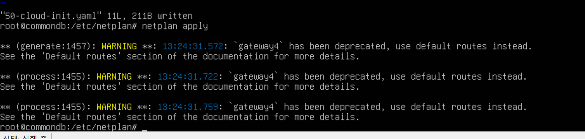

# hyper-V 가상환경 세팅 (ubuntu)

## 0. 가상환경 기본정보 설정

- 1세대
- 메모리 : 2048, 동적 해제
- 네트워크 : 외부스위치 (vm끼리만 사용할 경우 내부스위치 추가)
    - [[Hyper-V] 가상스위치관리자 3가지 종류](https://lalla3991.tistory.com/74)
    - [[Hyper-V] 가상스위치 설정 / 네트워크 설정](https://da2uns2.tistory.com/entry/Hyper-V-%EA%B0%80%EC%83%81-%EC%8A%A4%EC%9C%84%EC%B9%98-%EC%84%A4%EC%A0%95)
- 설치옵션
    - CD/DVD-ROM 에서 iso 선택

## 1. iso 설정 후 아래 화면에서 넘어가지 않을 경우


- hyper-V 가상머신이 PXE(Network Boot) 시도 중 다음단계로 넘어가지 못하고 멈춰있는 상태
- iso 또는 vhd 가 연결되지 않았을 경우 발생

### 확인

1. 부팅 가능한 iso 인지 확인
2. 부팅 순서 확인
    - 설정 > 펌웨어(firmware)에서 순서 설정 : 부팅순서에서 DVD 또는 하드디스크가 PXE보다 먼저 오도록
3. 가상 하드디스크 연결 여부 확인
    - 설정 > 하드드라이브 메뉴
    - 부팅 가능한 vhdx 파일인지 확인인

## 2. 에러 화면


- hyper-v 가상머신 부팅에 실패 시 나타나는 오류 메시지

### 문제 내용

1. SCSI DVD (0,1)     
   The signed image's hash is not allowed (DB)
   > 보안 부팅(Secure Boot) 설정으로 인해 ISO 이미지의 서명이 허용되지 않음

2. Network Adapter   
   A boot image was not found.
   > PXE 네트워크 부팅 실패

3. SCSI Disk (0,0)   
   The boot loader did not load an operating system.
   > 디스크에 부팅 가능한 OS가 없음

### 해결 방법

1. 보안 부팅 비활성화 (Secure Boot 끄기)
    - Hyper-V 관리자 실행
    - 해당 가상 머신 오른쪽 클릭 → 설정
    - 펌웨어 > 보안 부팅(Secure Boot) 체크 해제
    - 저장 후 가상 머신 재시작

** 보안 부팅이 활성화되어 있으면, 일부 ISO 파일(특히 비공식, 구버전, 리눅스 계열 등)이 차단될 수 있음

---

## 3. 가상환경 설정

- English
- IPv4 Method Manual >> ip수동설정
    ```
    Subnet: 192.168.2.xx/24
    Address: 192.168.2.xx
    Gateway: 192.168.2.1
    Name servers : 8.8.8.8,1.1.1.1
    ```
    - gateway, nameServer 값 :: powershell `ipconfig -all`
    - 현재 사용중인 ip대역 :: `arp -a`
        - 곂치지 않게 설정 필요
- proxy 설정: 빈칸
- mirror 어드레스
    - 기본설정도 동작하지만 kakao가 더 정확함
    - `http://mirror.kakao.com/ubuntu`

### 1. ip고정 설정 확인

- 가상환경 셜정 과정에서 고정하지 않았을 경우 수정 가능
- `/etc/netplan/` 경로 내 `yaml` 파일 수정

```yaml
network:
version: 2
ethernets:
eth0:
  addresses:
    - 192.168.2.100/24 # 실제 내가 사용할 ip
  routes: # 없을 경우 아래 에러 확인
    - to: 0.0.0.0/0
        via: 192.168.45.1
  nameservers:
  addresses:
    - 210.220.163.82
    - 219.250.36.130

# 변경 후 저장
#       netplan apply
```

#### 에러확인



- `netplan` 설정 파일에서 사용한 `gateway4` 항목이 더 이상 권장되지 않으며, 대신 `routes:`를 사용해서 기본 게이트웨이를 설정하라는 것
    - `routes:` 내용 확인
    - `to:`: 목적지 주소
        - 도달하고자 하는 네트워크 범위
    - `via:` 게이트웨이 주소
        - 목적지로 가기 위해 경유해야 하는 라우터(게이트웨이) 의 ip 주소

#### `gateway4`, `routes` 둘 다 설정 필요

- `gateway4`: 간단한 설정용, 대부분 작동하지만 비추천(deprecated) 경고가 뜸
- `routes`: 최신 방식, 향후 호환성 보장됨

### 2. 비밀번호 변경

사용자 비밀번호 변경

```bash
# 현재 접속한 계정의 비밀번호 변경
passwd

# 특정 계정의 비밀번호 변경 ex) hjkim
passwd hjkim

# root 계정 비밀번호 변경
sudo su
passwd
```

### 3. mirror 주소 변경

```bash
# vi /etc/apt/source.list

# esc 누른 후 아래 값입력하면 일괄로 변경됨.
# %s/{변경대상}/{변경값}
:%s/kr.archive.ubuntu.com/mirror.kakao.com
```

### 4. ssh 설정 확인

#### 1. ssh 설치 확인

- 가상머신 구축과정에서 ssh 설치를 하지 않았을 경우 설치 필요
- `/etc/ssh/sshd_config` 파일이 있다 >> 설치 됐다.
- 없을 경우
    ```bash
    # 설치
    sudo apt-get install ssh open-server

    # ssh 재시작
    systemctl restart sshd    
    ```

#### 2. root 로그인 허용

```bash
# vi /etc/ssh/sshd_config 아래 수정 후 저장
PermitRootLogin yes

# 재시작
systemctl restart sshd    
```
